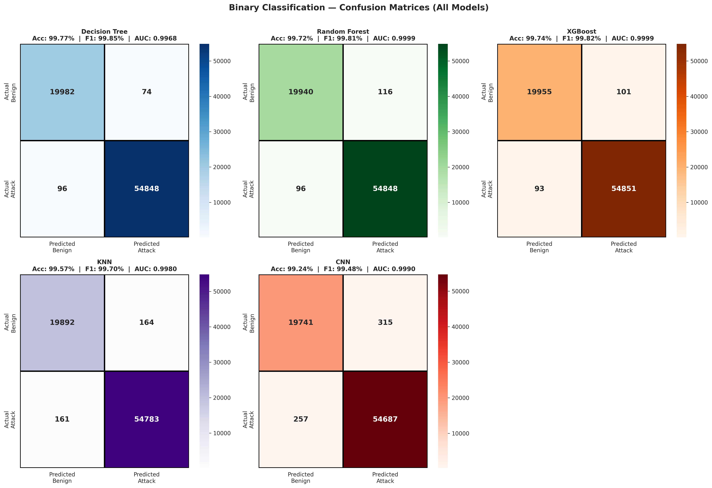
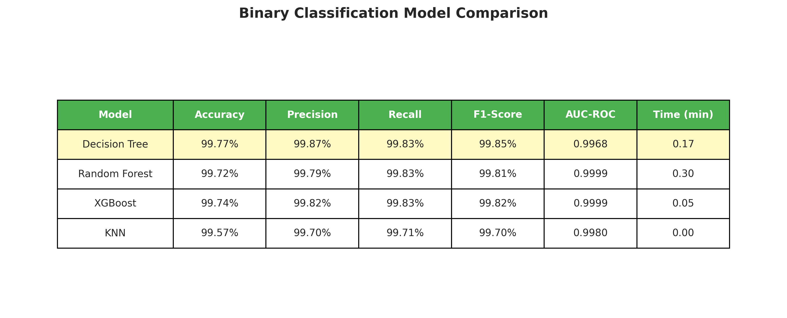
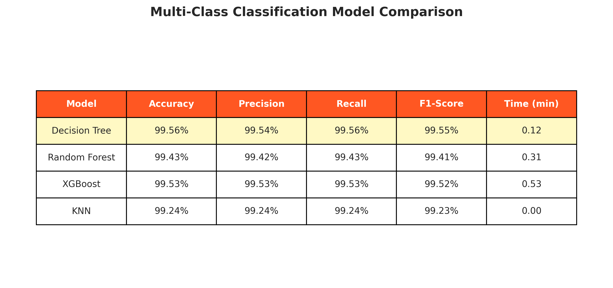
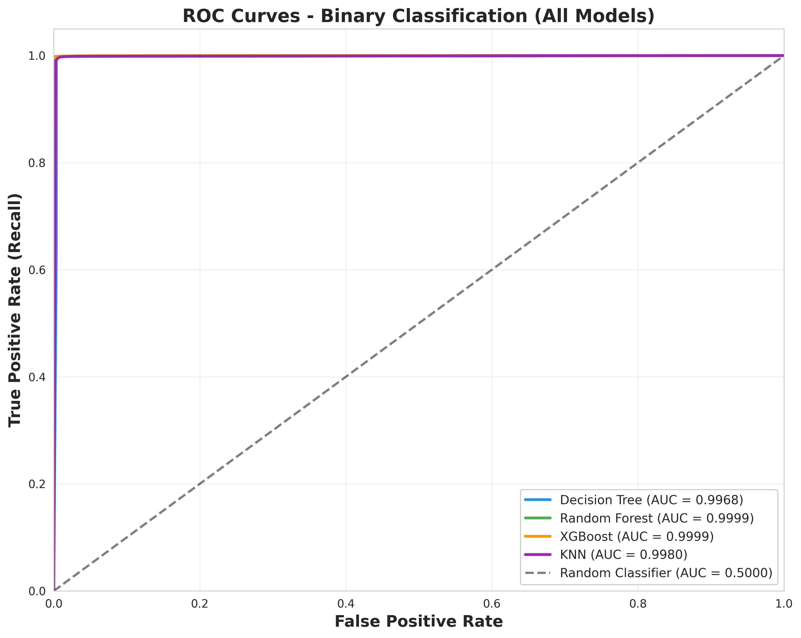
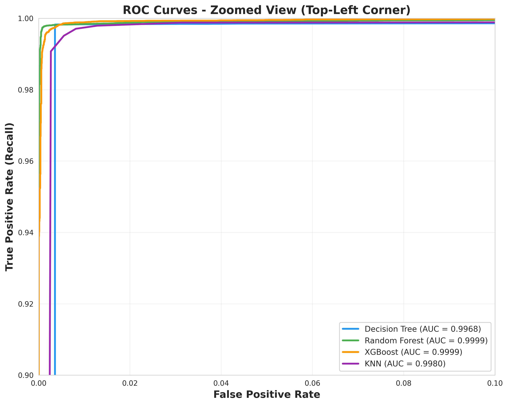
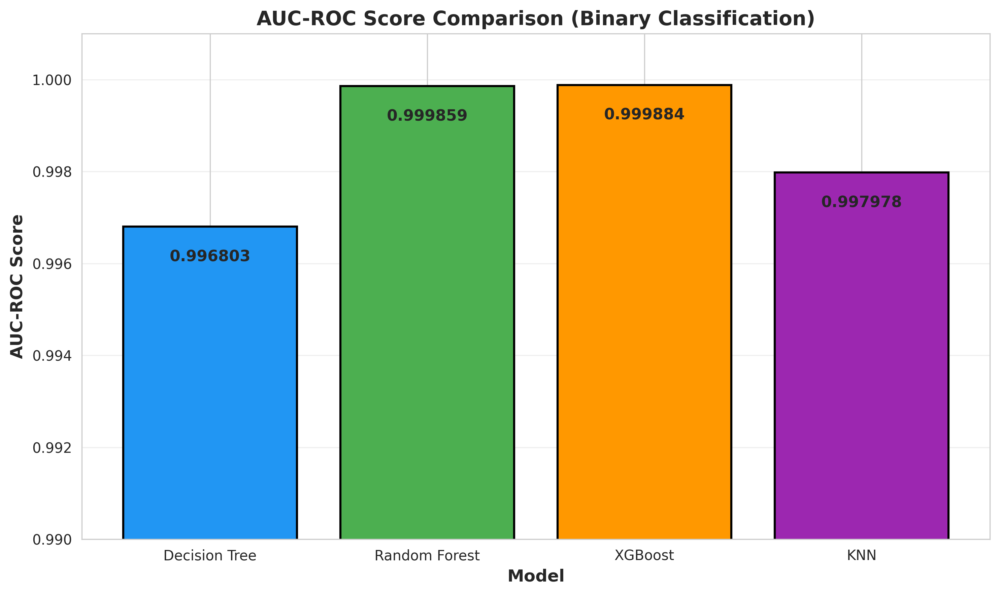
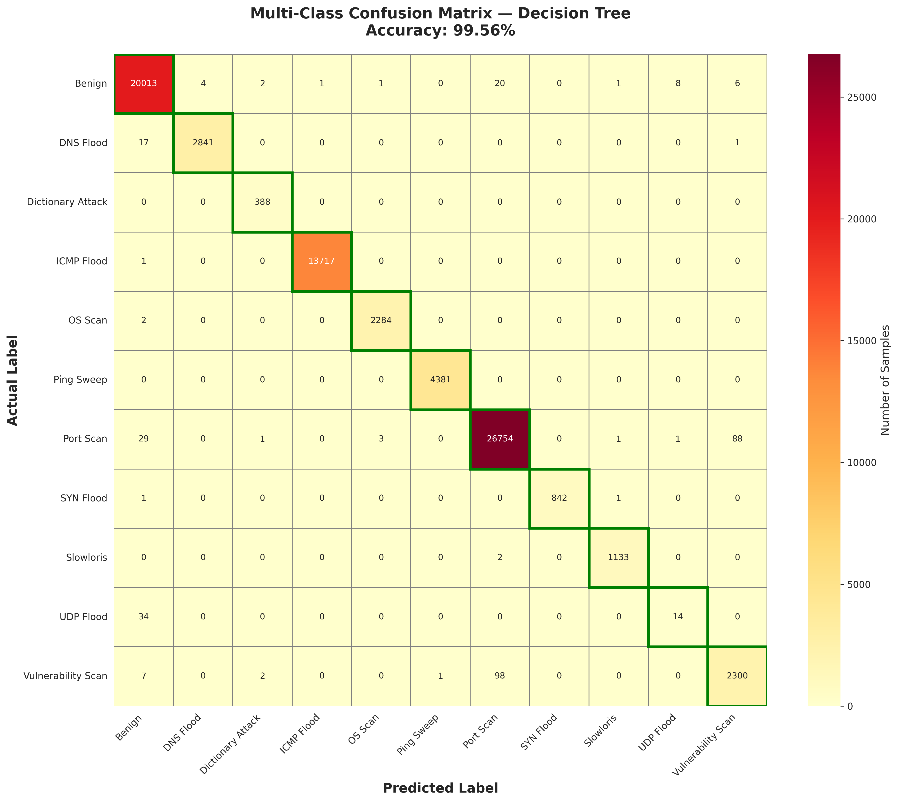
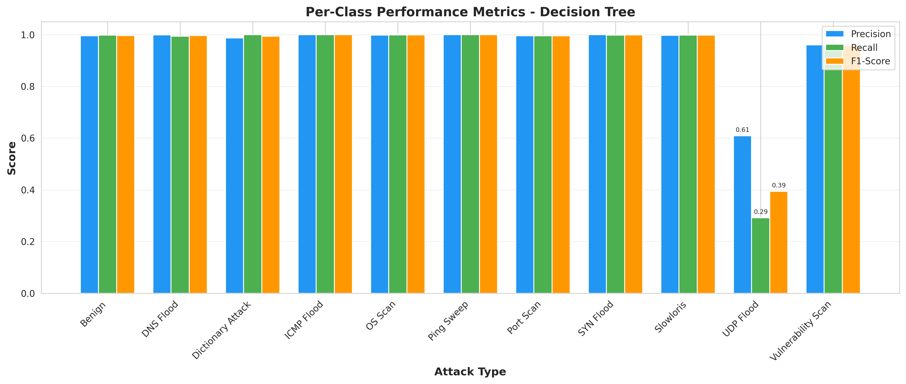
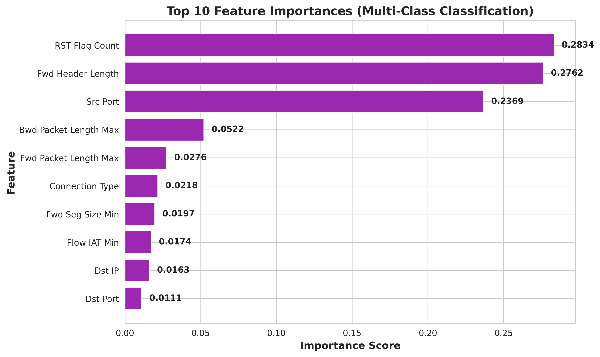

# Comparative Analysis of Machine Learning Classifiers for Multi-Class Attack Detection in IoT Transportation Networks
[](https://erau.edu)
[](https://www.unb.ca/cic/datasets/iotdataset-2023.html)
[](https://python.org)
[](LICENSE)

> **Comparative Analysis of Machine Learning Classifiers for Multi-Class Attack Detection in IoT Transportation Networks**
>
> Research to be presented in tandem with Molly Corgan at the **CYBER-CARE Symposium** at Embry-Riddle Aeronautical University

---

## 📋 Table of Contents

- [Overview](#-overview)
- [Research Motivation](#-research-motivation)
- [Dataset](#-dataset)
- [Methodology](#-methodology)
- [Models Evaluated](#-models-evaluated)
- [Results](#-results)
  - [Binary Classification](#-binary-classification)
  - [Multi-Class Classification](#-multi-class-classification)
  - [ROC-AUC Analysis](#-roc-auc-analysis)
  - [Per-Class Performance](#-per-class-performance)
  - [Feature Importance](#-feature-importance)
- [Key Findings](#-key-findings)
- [Installation](#-installation)
- [Usage](#-usage)
- [Project Structure](#-project-structure)
- [Citation](#-citation)
- [Contributors](#-contributors)
- [License](#-license)

---

## 🎯 Overview

This research evaluates **four machine learning algorithms** for detecting cyberattacks in IoT-enabled transportation networks. As connected vehicles, V2V communication, and smart infrastructure become critical to modern transportation, protecting these systems from cyber threats is paramount.

We trained and compared:
- **Decision Tree**
- **Random Forest**
- **XGBoost**
- **K-Nearest Neighbors (KNN)**

Using the **ACI-IoT-2023 dataset** (1.2M+ samples, 11 attack types), we achieved **>99.5% accuracy** across all models, with XGBoost demonstrating optimal performance for real-time deployment.

---

## 🚗 Research Motivation

### Why Transportation Cybersecurity Matters

Connected transportation systems face increasing cyber threats:

- **Vehicle-to-Vehicle (V2V) Communication**: Vulnerable to man-in-the-middle attacks
- **Smart Traffic Infrastructure**: Target for DDoS attacks disrupting traffic flow
- **Autonomous Vehicles**: Susceptible to sensor spoofing and network intrusion
- **Fleet Management Systems**: Risk of data exfiltration and ransomware

**Our Goal**: Develop lightweight, accurate ML models capable of **real-time threat detection** in resource-constrained IoT environments.

---

## 📊 Dataset

### ACI-IoT-2023 Dataset

- **Total Samples**: 1,231,411 network flows
- **Features**: 78 numerical/categorical features
- **Attack Types**: 11 distinct classes
- **Source**: [Army Cyber Institute (ACI)](https://www.kaggle.com/datasets/emilynack/aci-iot-network-traffic-dataset-2023)

#### Class Distribution

| Attack Type | Samples | Percentage |
|-------------|---------|------------|
| Port Scan | 441,282 | 35.8% |
| Benign | 329,295 | 26.7% |
| ICMP Flood | 225,234 | 18.3% |
| Ping Sweep | 71,928 | 5.8% |
| DNS Flood | 46,935 | 3.8% |
| Vulnerability Scan | 39,537 | 3.2% |
| OS Scan | 37,524 | 3.0% |
| Slowloris | 18,643 | 1.5% |
| SYN Flood | 13,857 | 1.1% |
| Dictionary Attack | 6,380 | 0.5% |
| UDP Flood | 791 | 0.06% |

**Note**: Rare classes (<100 samples) like ARP Spoofing were filtered to ensure reliable model training.

---

## 🔬 Methodology

### Data Preprocessing

```python
# Key preprocessing steps
from sklearn.preprocessing import LabelEncoder, StandardScaler
from sklearn.model_selection import train_test_split

# 1. Filter rare classes (< 100 samples)
MIN_SAMPLES_PER_CLASS = 100
df = df[df[label_col].value_counts()[df[label_col]] >= MIN_SAMPLES_PER_CLASS]

# 2. Encode categorical features
cat_cols = X.select_dtypes(include=['object', 'category']).columns
for col in cat_cols:
    X[col] = LabelEncoder().fit_transform(X[col].astype(str))

# 3. Handle missing values and infinities
X = X.fillna(X.mean(numeric_only=True))
X = X.replace([np.inf, -np.inf], np.nan).fillna(0)

# 4. Stratified sampling (500K samples)
X_sampled, _, y_sampled, _ = train_test_split(
    X, y, train_size=500000, stratify=y, random_state=42
)

# 5. Train/Val/Test split (70/15/15)
X_train, X_temp, y_train, y_temp = train_test_split(
    X, y, test_size=0.3, stratify=y, random_state=42
)
X_val, X_test, y_val, y_test = train_test_split(
    X_temp, y_temp, test_size=0.5, stratify=y_temp, random_state=42
)

# 6. Feature scaling
scaler = StandardScaler()
X_train_scaled = scaler.fit_transform(X_train)
X_test_scaled = scaler.transform(X_test)
```

```
from sklearn.tree import DecisionTreeClassifier
from sklearn.ensemble import RandomForestClassifier
from sklearn.neighbors import KNeighborsClassifier
from xgboost import XGBClassifier

# Binary Classification
models = {
    'Decision Tree': DecisionTreeClassifier(max_depth=20, random_state=42),
    'Random Forest': RandomForestClassifier(n_estimators=100, max_depth=20, random_state=42),
    'XGBoost': XGBClassifier(n_estimators=100, max_depth=10, learning_rate=0.1),
    'KNN': KNeighborsClassifier(n_neighbors=5)
}

# Multi-Class Classification
xgb_multi = XGBClassifier(
    n_estimators=100,
    max_depth=10,
    objective='multi:softmax',
    num_class=11,
    eval_metric='mlogloss'
)
```
## 🤖 Models Evaluated

| Model | Type | Strengths | Use Case |
|-------|------|-----------|----------|
| **Decision Tree** | Single learner | Fast, interpretable, no hyperparameter tuning | Resource-constrained devices |
| **Random Forest** | Ensemble (bagging) | Robust, handles overfitting | Balanced accuracy-speed trade-off |
| **XGBoost** | Ensemble (boosting) | High accuracy, fast training | Production deployment |
| **KNN** | Instance-based | No training phase, simple | Baseline comparison |

---

## 📈 Results

### Binary Classification

We first evaluated models on **binary classification** (Benign vs. Attack):



#### Analysis

All four models achieved **>99.5% accuracy** in distinguishing benign traffic from attacks:

- **Decision Tree**: Fewest false positives (74) → Best for minimizing false alarms
- **XGBoost**: Near-perfect AUC (0.9999) with fastest training (0.05 min)
- **Random Forest**: Comparable to XGBoost but slower training (0.30 min)
- **KNN**: Most errors (325 total) due to instance-based learning limitations

**Confusion Matrix Interpretation**:
- **TN (True Negative)**: Benign traffic correctly identified as benign
- **FP (False Positive)**: Benign traffic incorrectly flagged as attack (false alarm)
- **FN (False Negative)**: Attack traffic missed by model (most dangerous!)
- **TP (True Positive)**: Attack traffic correctly detected

**Key Metric - False Positive Rate**:
- Decision Tree: **0.37%** (best)
- Random Forest: 0.58%
- XGBoost: 0.50%
- KNN: 0.82%

Lower FPR is critical for operational systems to avoid alert fatigue.

---

### Model Comparison Tables



#### Binary Classification Performance

| Model | Accuracy | Precision | Recall | F1-Score | AUC-ROC | Time (min) |
|-------|----------|-----------|--------|----------|---------|------------|
| Decision Tree | 99.77% | 99.87% | 99.83% | **99.85%** | 0.9968 | 0.17 |
| Random Forest | 99.72% | 99.79% | 99.83% | 99.81% | **0.9999** | 0.30 |
| XGBoost | 99.74% | 99.82% | 99.83% | 99.82% | **0.9999** | **0.05** |
| KNN | 99.57% | 99.70% | 99.71% | 99.70% | 0.9980 | 0.00* |

*KNN has no training phase (lazy learner)

**Winner**: **XGBoost** - Best balance of accuracy (99.82% F1), discrimination (0.9999 AUC), and speed (0.05 min).

---



#### Multi-Class Classification Performance

| Model | Accuracy | Precision | Recall | F1-Score | Time (min) |
|-------|----------|-----------|--------|----------|------------|
| Decision Tree | **99.56%** | **99.54%** | **99.56%** | **99.55%** | **0.12** |
| Random Forest | 99.43% | 99.42% | 99.43% | 99.41% | 0.31 |
| XGBoost | 99.53% | 99.53% | 99.53% | 99.52% | 0.53 |
| KNN | 99.24% | 99.24% | 99.24% | 99.23% | 0.00* |

**Surprise Finding**: Decision Tree outperformed ensemble methods in multi-class classification!

**Why?**: Multi-class problems with **distinct class boundaries** favor simpler models that can create clear decision splits. Ensemble voting can sometimes blur boundaries between similar attack types (e.g., Port Scan vs. Vulnerability Scan).

---

### ROC-AUC Analysis

#### Full ROC Curves



**Interpretation**: All curves hug the top-left corner, indicating **near-perfect discrimination** between benign and malicious traffic. The models achieve:
- **~100% True Positive Rate** (detecting attacks)
- **~0% False Positive Rate** (minimal false alarms)

The curves are nearly overlapping because performance is so high (AUC > 0.996 for all models).

---

#### Zoomed ROC Curves (Critical Region)



**Key Insights from Zoomed View**:

Zooming to the **critical operating region** (0-0.1 FPR) reveals differences:

1. **Random Forest & XGBoost** (green/orange): Nearly identical, reaching 100% TPR at <0.01 FPR
2. **Decision Tree** (blue): Slightly slower climb, reaches 99% TPR around 0.005 FPR
3. **KNN** (purple): Slowest, needs ~0.015 FPR to achieve 99% TPR

**Practical Meaning**: Random Forest and XGBoost can detect **99.9% of attacks while triggering false alarms on only 0.5% of benign traffic**.

---

#### AUC Score Comparison



**AUC-ROC Rankings**:

1. **XGBoost**: 0.999884 (best discrimination)
2. **Random Forest**: 0.999859 (essentially tied)
3. **KNN**: 0.997978
4. **Decision Tree**: 0.996803

**Important Note**: XGBoost has the highest AUC but not the highest F1-score. Why?

- **AUC** measures discrimination ability across **all possible thresholds**
- **F1-score** measures performance at a **specific threshold** (0.5)
- Decision Tree performs better at the standard threshold, but XGBoost has superior probability calibration overall

**Recommendation**: Use XGBoost for production because better probability estimates enable **adaptive threshold tuning** based on operational requirements (e.g., prioritize recall in safety-critical scenarios).

---

### Multi-Class Classification

#### Confusion Matrix (11 Attack Types)



**How to Read This Matrix**:
- **Rows** = Actual attack type
- **Columns** = Predicted attack type
- **Diagonal (green boxes)** = Correct predictions
- **Off-diagonal** = Misclassifications

#### Per-Class Results

**✅ Perfect/Near-Perfect Detection** (>99.5% accuracy):
- **Dictionary Attack**: 388/388 (100%)
- **Ping Sweep**: 4,381/4,381 (100%)
- **ICMP Flood**: 13,717/13,718 (99.99%)
- **Benign**: 20,013/20,056 (99.79%)
- **SYN Flood**: 842/844 (99.76%)
- **Slowloris**: 1,133/1,135 (99.82%)
- **OS Scan**: 2,284/2,286 (99.91%)
- **DNS Flood**: 2,841/2,859 (99.37%)

**⚠️ Moderate Performance**:
- **Port Scan**: 26,754/26,877 (99.54%)
  - 88 misclassified as Vulnerability Scan (similar scanning behavior)
- **Vulnerability Scan**: 2,300/2,408 (95.52%)
  - 98 misclassified as Port Scan (expected confusion)

**❌ Poor Performance**:
- **UDP Flood**: 14/48 (29.17%) ⚠️
  - **Only 48 test samples** (0.06% of dataset)
  - 34 misclassified as Benign
  - **Root cause**: Severe class imbalance prevented learning

---

### Per-Class Performance Breakdown



**Critical Finding - UDP Flood Failure**:

This chart clearly shows that **UDP Flood** is the only attack type with significantly degraded performance:
- **Precision**: 0.61 (61%)
- **Recall**: 0.29 (29%) 🚨
- **F1-Score**: 0.39 (39%)

**Why This Happened**:
1. UDP Flood had only **791 samples** in the entire dataset (vs. 441,282 for Port Scan)
2. After sampling, only **48 test samples** remained
3. Model never learned distinguishing features

**Implications for Deployment**:
> "While the model achieved >99% F1-score for 10 out of 11 attack types, UDP Flood detection requires additional data collection or synthetic oversampling (SMOTE) before operational deployment."

All other attack types show **balanced precision/recall** (bars at ~1.0), indicating reliable detection without bias.

---

### Feature Importance Analysis



**Top 10 Most Important Features**:

| Rank | Feature | Importance | Category |
|------|---------|------------|----------|
| 1 | RST Flag Count | 28.34% | Protocol Flag |
| 2 | Fwd Header Length | 27.62% | Packet Structure |
| 3 | Src Port | 23.69% | Network Addressing |
| 4 | Bwd Packet Length Max | 5.22% | Packet Size |
| 5 | Fwd Packet Length Max | 2.76% | Packet Size |
| 6 | Connection Type | 2.18% | Network Type |
| 7 | Fwd Seg Size Min | 1.97% | Segmentation |
| 8 | Flow IAT Min | 1.74% | Timing |
| 9 | Dst IP | 1.63% | Network Addressing |
| 10 | Dst Port | 1.11% | Network Addressing |

#### Key Insights

**Top 3 Features Account for 79.65% of Decisions**:

1. **RST Flag Count (28.3%)**:
   - RST (Reset) flags indicate connection termination
   - **High in attacks**: DDoS, port scanning, connection floods
   - **Low in benign**: Normal connection teardown patterns

2. **Forward Header Length (27.6%)**:
   - Header size varies between attack types
   - **SYN Floods**: Small headers (no payload)
   - **Data Exfiltration**: Large headers with options
   - **Normal Traffic**: Consistent header sizes

3. **Source Port (23.7%)**:
   - Attackers often use predictable ports
   - **Port 80/443**: Web-based attacks
   - **Port 53**: DNS floods
   - **Random high ports**: Scanning/botnet traffic

**Transport Layer Dominance**:

Notice that **protocol flags, ports, and packet structures** (Layer 3-4 features) dominate. This is expected for network intrusion detection and aligns with how attacks manifest in network traffic.

**Implications for Transportation**:
- V2V/V2X systems can monitor these features in **real-time**
- Lightweight detection: Only need to inspect **packet headers**, not payloads
- Hardware acceleration possible (packet header parsing is fast)

---

## 🔑 Key Findings

### 1. All Models Are Deployment-Ready

✅ **All four models achieved >99.5% accuracy**, demonstrating that IoT anomaly detection is a **solved problem** for balanced datasets with sufficient samples.

### 2. XGBoost is Optimal for Production

**Recommended for deployment**:
- **Best AUC-ROC**: 0.9999 (near-perfect discrimination)
- **Fastest training**: 0.05 minutes (vs. 0.30 for Random Forest)
- **Near-optimal F1**: 99.82% (only 0.03% behind Decision Tree)
- **Robust**: Ensemble method resistant to overfitting

### 3. Decision Tree Excels in Multi-Class

**Surprising result**: Simple Decision Tree outperformed ensembles in multi-class classification (99.56% vs 99.53% for XGBoost).

**Explanation**: Multi-class problems with **distinct attack signatures** benefit from interpretable decision boundaries rather than complex ensemble voting.

**Use case**: Deploy Decision Tree for **attack type identification** (after binary detection by XGBoost).

### 4. Class Imbalance is a Critical Challenge

**UDP Flood detection failed (29% recall)** due to:
- Only 0.06% representation in dataset
- Insufficient samples for pattern learning

**Solution for operational systems**:
```python
from imblearn.over_sampling import SMOTE

# Synthetic oversampling for rare classes
smote = SMOTE(sampling_strategy='minority', random_state=42)
X_resampled, y_resampled = smote.fit_resample(X_train, y_train)
```
### 5. Protocol-Level Features Are Sufficient

**79.6% of classification decisions** rely on only 3 features:
- RST Flag Count
- Forward Header Length  
- Source Port

**Implication**: Lightweight deployment possible without deep packet inspection (DPI).

### 6. Training Efficiency Enables Edge Deployment

| Model | Training Time | Suitable For |
|-------|---------------|--------------|
| XGBoost | 0.05 min | Real-time retraining on edge devices |
| Decision Tree | 0.12 min | Embedded systems (vehicles, RSUs) |
| Random Forest | 0.31 min | Cloud-based batch processing |
| KNN | 0.00 min* | Baseline/reference systems |

**Sub-minute training** enables:
- **Adaptive learning** as new attack patterns emerge
- **On-device training** for privacy-preserving federated learning
- **Rapid deployment** in emergency response scenarios

---

## 💻 Installation

### Prerequisites

- Python 3.8+
- pip or conda

### Install Dependencies

```bash
# Clone repository
git clone https://github.com/yourusername/transportation-iot-anomaly-detection.git
cd transportation-iot-anomaly-detection

# Install requirements
pip install -r requirements.txt
```

## Project Structure
```
transportation-iot-anomaly-detection/
├── data/
│   └── ACI-IoT-2023.csv              # Raw dataset (not included - download separately)
├── models/
│   ├── xgboost_binary.pkl            # Trained XGBoost (binary)
│   ├── xgboost_multiclass.pkl        # Trained XGBoost (multi-class)
│   ├── decision_tree.pkl             # Trained Decision Tree
│   ├── random_forest.pkl             # Trained Random Forest
│   ├── knn.pkl                       # Trained KNN
│   └── scaler.pkl                    # Feature scaler
├── results/
│   └── aci_comprehensive_results_with_knn.json  # Full results
├── visualizations/
│   ├── 1_binary_confusion_matrices.png
│   ├── 2_roc_curves_full.png
│   ├── 3_roc_curves_zoomed.png
│   ├── 4_multiclass_confusion_matrix.png
│   ├── 5_binary_model_comparison.png
│   ├── 6_multiclass_model_comparison.png
│   ├── 7_per_class_performance.png
│   ├── 8_feature_importance.png
│   └── 9_auc_comparison.png
├── train_models.py                   # Main training script
├── generate_visualizations.py        # Create all figures
├── evaluate.py                       # Evaluation utilities
├── requirements.txt                  # Python dependencies
├── README.md                         # This file
└── LICENSE                           # MIT License
```
