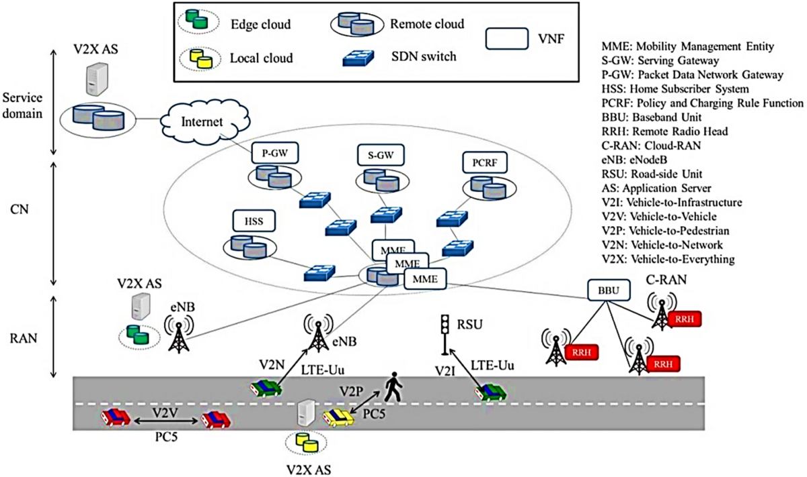
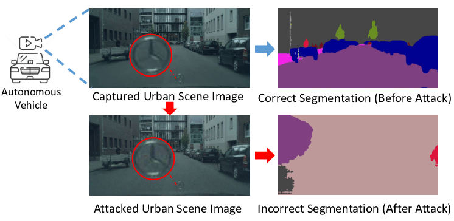
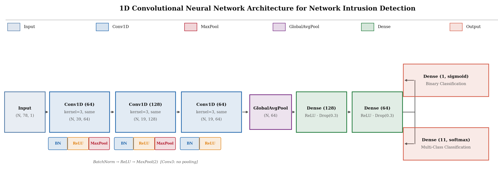
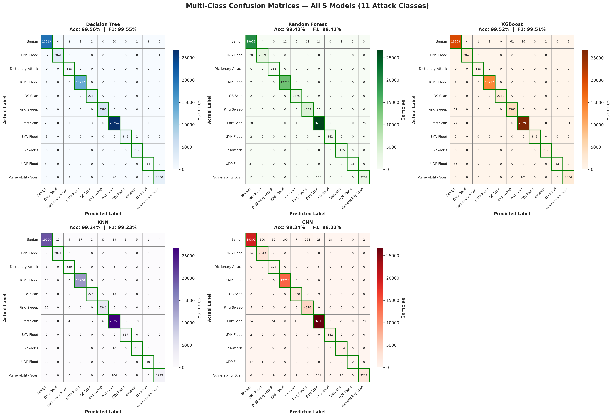
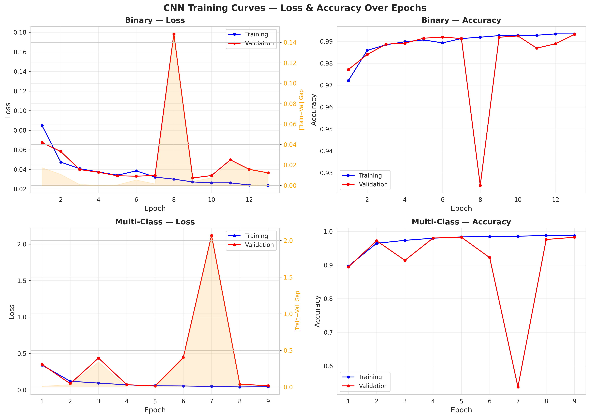
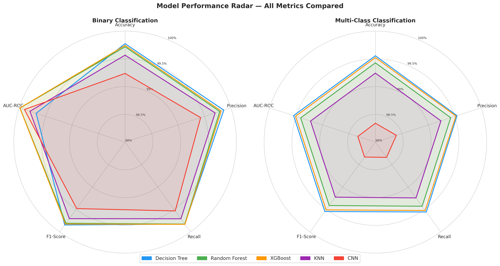

# Machine Learning-Based Anomaly Detection for Traffic in IoT-Enabled Transportation Networks
[](https://erau.edu)
[](https://www.unb.ca/cic/datasets/iotdataset-2023.html)
[](https://python.org)
[](LICENSE)

> **Machine Learning-Based Anomaly Detection for Traffic in IoT-Enabled Transportation Networks**
>
> Research to be presented in tandem with Molly Corgan at the **CYBER-CARE Symposium** at Embry-Riddle Aeronautical University

---

## Table of Contents

- [Overview](#overview)
- [Research Motivation](#research-motivation)
- [Dataset](#dataset)
- [Training Pipeline](#training-pipeline)
- [Models Evaluated](#models-evaluated)
- [Results](#results)
- [Key Findings](#key-findings)
- [Installation](#installation)
- [Project Structure](#project-structure)

---

> **Figure:** An illustration of Vehicle-to-Vehicle (V2V) communication in a connected transportation environment. Vehicles exchange real-time network traffic data with one another and with roadside infrastructure. This communication layer is the primary attack surface this research aims to protect — malicious traffic injected into these channels can compromise navigation, safety systems, and fleet management.

## Overview

This research evaluates **five machine learning algorithms** for detecting cyberattacks in IoT-enabled transportation networks. As connected vehicles, V2V communication, and smart infrastructure become critical to modern transportation, protecting these systems from cyber threats is paramount.

We trained and compared:
- **Decision Tree**
- **Random Forest**
- **XGBoost**
- **K-Nearest Neighbors (KNN)**
- **1D Convolutional Neural Network (CNN)**

Using the **ACI-IoT-2023 dataset** (1.2M+ samples, 11 attack types), we achieved **>99.5% accuracy** across all classical models, with XGBoost demonstrating optimal performance for real-time deployment. The CNN was added as a deep learning baseline, achieving 99.24% binary and 98.34% multi-class accuracy.

---

## Research Motivation

### Why Transportation Cybersecurity Matters

Connected transportation systems face increasing cyber threats:

- **Vehicle-to-Vehicle (V2V) Communication**: Vulnerable to man-in-the-middle attacks
- **Smart Traffic Infrastructure**: Target for DDoS attacks disrupting traffic flow
- **Autonomous Vehicles**: Susceptible to sensor spoofing and network intrusion
- **Fleet Management Systems**: Risk of data exfiltration and ransomware

### Real-World Attack Example: Adversarial Perception Manipulation


> **Figure:** A side-by-side comparison showing the effect of an adversarial network attack on an autonomous vehicle's semantic segmentation model. The top panel shows normal operation — the AI correctly identifies road surfaces, pedestrians, vehicles, and surrounding objects. The bottom panel shows the same scene after an attacker injects adversarial noise through a compromised V2X channel: the AI misclassifies a pedestrian as drivable road surface, meaning the vehicle would accelerate toward them. This example motivates the need for real-time network intrusion detection before such payloads reach the perception pipeline.

Demonstration of semantic segmentation attack on autonomous vehicle perception.

The diagram above illustrates a critical vulnerability in autonomous driving systems if the attack is not detected and suppressed:

1. **Normal Operation (Top)**: The vehicle's camera captures an urban scene and correctly identifies the scene through semantic segmentation. The AI classifies road surface (purple), buildings/non important features (grey), trees (yellow), vehicles (blue), sidewalks (pink), and pedestrians (red), enabling safe navigation decisions.

2. **Under Attack (Bottom)**: An attacker compromises the vehicle's network and injects adversarial noise into the perception pipeline. While the scene appears identical to human observers, the AI's segmentation model **fails catastrophically**—the pedestrian is misclassified as drivable road surface (purple). The vehicle would now accelerate directly toward the pedestrian, believing the path is clear.

**This is not theoretical**: Research has demonstrated that adversarial attacks can be executed through:
- Compromised V2X communication channels
- Malicious Over-The-Air (OTA) updates
- Physical adversarial patches on road signs
- GPS spoofing combined with camera manipulation

**Our Goal**: Develop lightweight, accurate ML models capable of **real-time threat detection** in resource-constrained IoT environments.

---

## Dataset

### ACI-IoT-2023 Dataset

- **Total Samples**: 1,231,406 network flows
- **Features**: 78 numerical/categorical features
- **Attack Types**: 11 distinct classes
- **Source**: [Army Cyber Institute (ACI)](https://www.kaggle.com/datasets/emilynack/aci-iot-network-traffic-dataset-2023)

#### Class Distribution

| Attack Type | Samples | Percentage |
|-------------|---------|------------|
| Port Scan | 441,282 | 35.8% |
| Benign | 329,295 | 26.7% |
| ICMP Flood | 225,234 | 18.3% |
| Ping Sweep | 71,928 | 5.8% |
| DNS Flood | 46,935 | 3.8% |
| Vulnerability Scan | 39,537 | 3.2% |
| OS Scan | 37,524 | 3.0% |
| Slowloris | 18,643 | 1.5% |
| SYN Flood | 13,857 | 1.1% |
| Dictionary Attack | 6,380 | 0.5% |
| UDP Flood | 791 | 0.06% |

**Note**: Rare classes (<100 samples) like ARP Spoofing were filtered to ensure reliable model training.

---

## Training Pipeline

All experiments were implemented in Python 3.8 using scikit-learn, XGBoost, TensorFlow/Keras, and NumPy, and executed on Google Colab with GPU acceleration. The pipeline proceeded through the following steps.

### Step 1 — Data Ingestion and Rare Class Removal

The raw ACI-IoT-2023 dataset was loaded from a single CSV file (~88.8 GB) containing 1,231,411 network flow records and 78 features. Attack classes with fewer than 100 samples were removed entirely, as they cannot be reliably partitioned into stratified train/validation/test subsets. ARP Spoofing fell below this threshold and was excluded. The filtered dataset retained **11 attack classes plus Benign**.

### Step 2 — Feature Matrix Construction and Target Label Encoding

The label column was isolated and two target label arrays were constructed in parallel:

- **Multi-class**: All class names encoded as integers (0–10) using `LabelEncoder`
- **Binary**: Records matching "benign", "normal", or "legitimate" assigned label `0`; all others assigned label `1`

Non-predictive identifier columns (IP addresses, timestamps, flow IDs) were dropped at this stage.

### Step 3 — Categorical Feature Encoding and Data Cleaning

All object/categorical columns were encoded to integers using `LabelEncoder` applied independently per column. Missing values (NaN) were imputed using the column-wise arithmetic mean. Infinite values — which arise in flow-derived statistics when denominators approach zero — were replaced with NaN and subsequently filled with zero. Final feature dimensionality: approximately **47–50 features**.

### Step 4 — Stratified Downsampling to 500,000 Records

Training KNN and Random Forest on 1M+ records is computationally prohibitive in a single-session environment. A stratified sample of exactly **500,000 records** was drawn using `train_test_split` with `stratify=y_encoded` and `random_state=42`. This ensures each class retains proportional representation. UDP Flood's 791 total records produced ~321 sampled records, which is the proximate cause of that class's degraded recall at test time.

### Step 5 — Train / Validation / Test Split (70% / 15% / 15%)

The 500,000-record sample was partitioned into three non-overlapping subsets using two sequential stratified splits:

- **Training set**: 70% (~350,000 records)
- **Validation set**: 15% (~75,000 records)
- **Test set**: 15% (~75,000 records)

The test set was isolated before any model fitting and accessed only once, at final evaluation.

### Step 6 — Feature Standardization

All features were standardized to zero mean and unit variance using `StandardScaler`. The scaler was **fit exclusively on the training set** and applied without refitting to the validation and test sets, preventing data leakage. Although Decision Tree and Random Forest are scale-invariant, XGBoost gradient updates, KNN distance computations, and CNN gradient flow are all sensitive to feature magnitude — uniform scaling ensures performance differences reflect algorithmic properties rather than scaling artifacts.

### Step 7 — Binary Classification Training

Five classifiers were trained on the binary-labeled training set:

| Model | Key Hyperparameters |
|-------|---------------------|
| Decision Tree | `max_depth=20` |
| Random Forest | `n_estimators=100`, `max_depth=20` |
| XGBoost | `n_estimators=100`, `max_depth=10`, `lr=0.1`, `objective=binary:logistic` |
| KNN | `k=5`, Euclidean distance |
| CNN | `Adam(lr=0.001)`, `batch_size=512`, `EarlyStopping(patience=4)`, ran 13 epochs |

Wall-clock training time was recorded for each model. After training, predicted class labels and predicted probabilities were generated on the held-out test set. ROC curve data were computed and stored for all five models.

### Step 8 — Multi-Class Classification Training

The same five classifiers were retrained on the multi-class-labeled training set with two modifications for XGBoost and CNN:

- **XGBoost**: objective changed to `multi:softmax`, `num_class=11`, `eval_metric=mlogloss`
- **CNN**: output layer changed from a single sigmoid unit to an 11-unit softmax layer; ran 9 epochs before early stopping

All other hyperparameters remained identical to ensure a controlled comparison between tasks. Weighted-average precision, recall, and F1-score were computed alongside per-class metrics for all 11 attack types.

### Step 9 — Evaluation and Result Serialization

For each model and each task, the following metrics were computed on the held-out test set: accuracy, weighted precision, weighted recall, weighted F1-score, AUC-ROC (binary only), confusion matrix (raw cell counts), per-class classification report (multi-class), and wall-clock training time in minutes. All results were serialized to `aci_comprehensive_results_with_knn.json`.

---

## CNN Architecture

The CNN treats each network flow's 78 features as a 1D sequence, allowing convolutional filters to capture local feature correlations that fully-connected layers would miss.


> **Figure:** A diagram of the 1D CNN architecture used in this study. The network ingests a single flow record as a sequence of shape (N, 78, 1) and passes it through three Conv1D blocks (with BatchNormalization, ReLU activation, and MaxPooling), followed by GlobalAveragePooling and two fully-connected Dense layers with dropout regularization. The architecture forks at the output into a sigmoid unit for binary classification and an 11-way softmax for multi-class classification.

```
Total parameters (binary):      67,265
Total parameters (multi-class): 67,915
Optimizer:  Adam (lr=0.001)
Batch size: 512
Early stopping patience: 4 epochs  |  LR reduce patience: 2 epochs
Binary stopped at epoch 13  |  Multi-class stopped at epoch 9
```

```python
# CNN input reshaping and training
X_train_cnn = X_train_scaled.reshape(X_train_scaled.shape[0], X_train_scaled.shape[1], 1)

callbacks = [
    EarlyStopping(monitor='val_loss', patience=4, restore_best_weights=True),
    ReduceLROnPlateau(monitor='val_loss', patience=2, factor=0.5)
]

model.fit(
    X_train_cnn, y_train,
    validation_data=(X_val_cnn, y_val),
    epochs=50,
    batch_size=512,
    callbacks=callbacks
)
```

**Why 1D CNN for tabular network data?** Related network flow features (e.g., forward/backward packet stats, flag counts) tend to appear in adjacent columns, so neighboring features carry correlated information that convolution can exploit. The tradeoff is higher training time and — on this dataset — lower accuracy than tree-based methods, suggesting that the tree models' ability to learn arbitrary feature interactions is better suited to tabular intrusion detection data than fixed-kernel convolution.

---

## Models Evaluated

| Model | Type | Strengths | Use Case |
|-------|------|-----------|----------|
| **Decision Tree** | Single learner | Fast, interpretable, no hyperparameter tuning | Resource-constrained devices |
| **Random Forest** | Ensemble (bagging) | Robust, handles overfitting | Balanced accuracy-speed trade-off |
| **XGBoost** | Ensemble (boosting) | High accuracy, fast training | Production deployment |
| **KNN** | Instance-based | No training phase, simple | Baseline comparison |
| **CNN** | Deep learning (1D Conv) | Learns local feature interactions, GPU-accelerated | Deep learning baseline |

---

## Results

### Binary Classification

We first evaluated all five models on **binary classification** (Benign vs. Attack):


> **Figure:** Confusion matrices for all five models on the binary classification task (Benign vs. Attack). Each matrix shows the counts of True Negatives (TN — benign correctly identified), False Positives (FP — benign flagged as attack), False Negatives (FN — attacks missed), and True Positives (TP — attacks correctly detected). Darker diagonal cells indicate stronger performance. The Decision Tree produces the fewest false positives (74), while the CNN generates the most errors overall (315 FP, 257 FN), reflecting its slightly lower accuracy on this task.

#### Analysis

All classical models achieved **>99.5% accuracy**. The CNN achieved 99.24%, slightly below the classical models:

- **Decision Tree**: Fewest false positives (74) → Best for minimizing false alarms
- **XGBoost**: Near-perfect AUC (0.9999) with fastest classical training (0.08 min)
- **Random Forest**: Comparable to XGBoost but slower training (0.31 min)
- **KNN**: Most errors among classical models
- **CNN**: 315 false positives, 257 false negatives; highest training time (1.25 min) but strong AUC of 0.9990

**Confusion Matrix Interpretation**:
- **TN (True Negative)**: Benign traffic correctly identified as benign
- **FP (False Positive)**: Benign traffic incorrectly flagged as attack (false alarm)
- **FN (False Negative)**: Attack traffic missed by model (most dangerous!)
- **TP (True Positive)**: Attack traffic correctly detected

---

### Model Comparison Tables


> **Figure:** A summary bar chart comparing all five models across Accuracy, Precision, Recall, F1-Score, AUC-ROC, and Training Time for the binary classification task. The y-axis is scaled to highlight the narrow performance band between models. XGBoost and Decision Tree lead on most metrics, while the CNN trails slightly on accuracy and F1 but maintains a competitive AUC of 0.9990.

#### Binary Classification Performance

| Model | Accuracy | Precision | Recall | F1-Score | AUC-ROC | Time (min) |
|-------|----------|-----------|--------|----------|---------|------------|
| Decision Tree | **99.77%** | **99.87%** | 99.83% | **99.85%** | 0.9968 | 0.17 |
| Random Forest | 99.72% | 99.79% | 99.83% | 99.81% | 0.9999 | 0.31 |
| XGBoost | 99.74% | 99.82% | 99.83% | 99.82% | **0.9999** | **0.08** |
| KNN | 99.57% | 99.70% | 99.71% | 99.70% | 0.9980 | 0.00* |
| CNN | 99.24% | 99.43% | 99.53% | 99.48% | 0.9990 | 1.25 |

*KNN has no training phase (lazy learner)

**Winner**: **XGBoost** — Best balance of accuracy (99.82% F1), discrimination (0.9999 AUC), and speed (0.08 min).

**CNN Note**: While the CNN trails classical models on accuracy and F1, its AUC of 0.9990 ranks third overall, indicating strong probability calibration. The 1.25-minute training time reflects GPU overhead on a small model rather than a fundamental scalability issue.

---


> **Figure:** A summary bar chart comparing all five models across Accuracy, Precision, Recall, and F1-Score for the multi-class classification task (11 attack categories). The Decision Tree leads all models despite being the simplest architecture, outperforming both ensemble methods and the CNN. The CNN shows the largest gap from the classical cluster, particularly on accuracy and F1-Score, underscoring the limitations of convolutional feature extraction on hand-engineered tabular data.

#### Multi-Class Classification Performance

| Model | Accuracy | Precision | Recall | F1-Score | Time (min) |
|-------|----------|-----------|--------|----------|------------|
| Decision Tree | **99.56%** | **99.54%** | **99.56%** | **99.55%** | **0.12** |
| Random Forest | 99.43% | 99.42% | 99.43% | 99.41% | 0.31 |
| XGBoost | 99.52% | 99.52% | 99.52% | 99.51% | 0.54 |
| KNN | 99.24% | 99.24% | 99.24% | 99.23% | 0.00* |
| CNN | 98.34% | 98.40% | 98.34% | 98.33% | 0.89 |

**Surprise Finding**: Decision Tree outperformed all models — including ensembles and the CNN — in multi-class classification.

**Why?** Multi-class problems with **distinct class boundaries** favor simpler models that create clean decision splits. Ensemble voting can blur boundaries between similar attack types (e.g., Port Scan vs. Vulnerability Scan), and the CNN's convolutional inductive bias is less effective when discriminating features are not spatially local in the feature vector.


> **Figure:** Confusion matrices for all five models on the 11-class attack classification task. Each row represents the true attack type and each column the predicted label; diagonal cells show correct classifications. The color scale reflects sample count, making high-frequency classes (Port Scan, Benign, ICMP Flood) visually dominant. The UDP Flood row stands out across all models with near-zero recall, reflecting the severe class imbalance (only 48 test samples). The CNN matrix shows more off-diagonal spread than the tree-based models, consistent with its lower overall F1-Score.

---

### ROC-AUC Analysis

#### Full ROC Curves


> **Figure:** Receiver Operating Characteristic (ROC) curves for all five models on the binary classification task, plotted across the full False Positive Rate (FPR) range of 0 to 1. Each curve shows the trade-off between True Positive Rate (TPR/Recall) and False Positive Rate at every classification threshold. All five models hug the top-left corner tightly, indicating near-perfect discrimination between benign and attack traffic. The diagonal dashed line represents a random classifier (AUC = 0.5) included as a reference baseline.

**Interpretation**: All curves hug the top-left corner, indicating **near-perfect discrimination** between benign and malicious traffic. All five models achieve AUC > 0.996.

---

#### Zoomed ROC Curves (Critical Region)


> **Figure:** A zoomed view of the ROC curves restricted to the 0–0.1 False Positive Rate region — the operationally critical zone where a deployed IDS must minimize false alarms while maximizing attack detection. Differences between models that are invisible on the full ROC plot become apparent here. Random Forest and XGBoost reach 100% TPR at under 0.01 FPR; Decision Tree achieves 99% TPR at approximately 0.005 FPR; the CNN reaches 99% TPR around 0.008 FPR; and KNN requires the highest FPR (~0.015) to match that detection rate.

**Key Insights from Zoomed View** (0–0.1 FPR region):

1. **Random Forest & XGBoost**: Nearly identical, reaching 100% TPR at <0.01 FPR
2. **CNN**: Strong probability calibration, reaches 99% TPR around 0.008 FPR
3. **Decision Tree**: Reaches 99% TPR around 0.005 FPR
4. **KNN**: Needs ~0.015 FPR to achieve 99% TPR

---

#### AUC Score Comparison


> **Figure:** A bar chart ranking all five models by their binary classification AUC-ROC score. The y-axis is scaled to the 0.996–1.000 range to make the small but meaningful differences between models visible. XGBoost and Random Forest tie at 0.9999, followed by the CNN (0.9990), KNN (0.9980), and Decision Tree (0.9968). A higher AUC indicates better ability to separate benign from malicious traffic across all possible classification thresholds, which is particularly important in deployments where the decision threshold must be tuned to operational requirements.

**AUC-ROC Rankings**:

1. **XGBoost**: 0.9999
2. **Random Forest**: 0.9999
3. **CNN**: 0.9990
4. **KNN**: 0.9980
5. **Decision Tree**: 0.9968

**Recommendation**: Use XGBoost for production — superior probability estimates enable **adaptive threshold tuning** based on operational requirements (e.g., prioritize recall in safety-critical scenarios).

---

### Per-Class Results

#### Per-Class Performance Breakdown


> **Figure:** A grouped bar chart showing per-class Precision, Recall, and F1-Score for the best-performing multi-class model (Decision Tree) across all 11 attack categories. Most classes achieve scores above 99% on all three metrics. The UDP Flood bar is a clear visual outlier — with only 48 test samples drawn from a dataset with 791 total UDP Flood records, all five models fail to learn a reliable decision boundary for this class, resulting in 29% recall and a 39% F1-Score. All other attack types are detected with high confidence.

**Per-Class Metrics (Best Multi-Class Model — Decision Tree)**:

| Attack Type | Precision | Recall | F1-Score | Support |
|-------------|-----------|--------|----------|---------|
| Benign | 99.55% | 99.79% | 99.67% | 20,056 |
| DNS Flood | 99.86% | 99.37% | 99.61% | 2,859 |
| Dictionary Attack | 98.73% | 100.00% | 99.36% | 388 |
| ICMP Flood | 99.99% | 99.99% | 99.99% | 13,718 |
| OS Scan | 99.83% | 99.91% | 99.87% | 2,286 |
| Ping Sweep | 99.98% | 100.00% | 99.99% | 4,381 |
| Port Scan | 99.55% | 99.54% | 99.55% | 26,877 |
| SYN Flood | 100.00% | 99.76% | 99.88% | 844 |
| Slowloris | 99.74% | 99.82% | 99.78% | 1,135 |
| **UDP Flood** | **60.87%** | **29.17%** | **39.44%** | **48** |
| Vulnerability Scan | 96.03% | 95.51% | 95.77% | 2,408 |

**Critical Finding — UDP Flood Failure**:

UDP Flood is the only attack type with significantly degraded performance across all models:
- **Recall: 29.17%** — the model misses ~70% of UDP Flood attacks
- **Root cause**: Only 791 total samples in the dataset → only 48 test samples after stratified splitting
- This is a **data problem, not a model problem** — the CNN, KNN, and tree models all fail similarly on this class

All other attack types show balanced precision/recall above 95%.

---
### CNN Training Curves


> **Figure:** Training and validation loss and accuracy curves over epochs for the CNN, shown separately for the binary (left) and multi-class (right) tasks. Blue lines represent training metrics and red lines represent validation metrics. The orange shaded region on the loss panels visualizes the absolute gap between training and validation loss, serving as an overfit indicator — a widening gap would suggest the model is memorizing training data. Both tasks converge with a tight gap, indicating good generalization. Sudden drops in the loss curves mark epochs where `ReduceLROnPlateau` halved the learning rate. The binary task ran for 13 epochs and the multi-class task for 9 before early stopping triggered.

The training curve plot shows loss and accuracy over epochs for both binary and multi-class tasks, with training (blue) and validation (red) lines plotted together. The orange shaded region on the loss panels shows the absolute train/validation gap — a visual overfit indicator.

Key observations:
- **Binary** stopped at epoch 13; validation loss tracks training loss closely with minimal gap, indicating the model generalized well and did not overfit.
- **Multi-class** stopped at epoch 9; slightly faster convergence, again with a tight train/validation gap.
- Both runs used `ReduceLROnPlateau` (patience=2), which is visible as sudden drops in the loss curve where the learning rate was halved.

---

### Model Radar Chart


> **Figure:** Radar (spider) charts comparing all five models simultaneously across five metrics — Accuracy, Precision, Recall, F1-Score, and AUC-ROC — for binary classification (left panel) and multi-class classification (right panel). The radial axis is zoomed to the 98–100% range to make the differences between high-performing models visible. Each model is represented by a distinct colored polygon; a larger, more outward polygon indicates better overall performance. Classical models (Decision Tree, Random Forest, XGBoost) cluster near the outer edge in both panels, while the CNN sits visibly inward on the multi-class panel, most noticeably on the Accuracy and F1-Score axes.

The radar chart plots all five models simultaneously across Accuracy, Precision, Recall, F1-Score, and AUC-ROC for both binary (left) and multi-class (right) tasks. Because all models score above 98%, the y-axis is zoomed to 98–100% to make the differences visible.

Key observations:
- Classical models (Decision Tree, Random Forest, XGBoost) cluster tightly near the outer edge in both panels.
- CNN sits slightly inward, most visibly on the multi-class panel where its 98.34% accuracy separates it from the 99%+ cluster.
- KNN traces a similar shape to the classical models in binary, but falls slightly behind in multi-class.

---

### Feature Importance Analysis


> **Figure:** A horizontal bar chart showing the top 10 most important features as ranked by Random Forest's Gini impurity-based feature importances. Each bar represents a feature's relative contribution to classification decisions across all trees in the forest, expressed as a percentage of total importance. The three dominant features — RST Flag Count (28.34%), Forward Header Length (27.62%), and Source Port (23.69%) — together account for nearly 80% of all decisions. Color coding groups features by category (protocol flags, packet structure, network addressing, timing). This concentration of importance in packet-header-level features supports the case for lightweight, header-only inspection in edge deployments.

**Top 10 Most Important Features** (Random Forest importances; used as proxy for CNN, which does not expose feature importances natively):

| Rank | Feature | Importance | Category |
|------|---------|------------|----------|
| 1 | RST Flag Count | 28.34% | Protocol Flag |
| 2 | Fwd Header Length | 27.62% | Packet Structure |
| 3 | Src Port | 23.69% | Network Addressing |
| 4 | Bwd Packet Length Max | 5.22% | Packet Size |
| 5 | Fwd Packet Length Max | 2.76% | Packet Size |
| 6 | Connection Type | 2.18% | Network Type |
| 7 | Fwd Seg Size Min | 1.97% | Segmentation |
| 8 | Flow IAT Min | 1.74% | Timing |
| 9 | Dst IP | 1.63% | Network Addressing |
| 10 | Dst Port | 1.11% | Network Addressing |

**Top 3 features account for 79.65% of decisions**:

1. **RST Flag Count (28.3%)**: High in DDoS/port scanning; consistent in benign traffic
2. **Forward Header Length (27.6%)**: Varies by attack type — SYN Floods have small headers; data exfiltration has large headers
3. **Source Port (23.7%)**: Attackers use predictable or random high ports; benign traffic uses known service ports

**Implication**: Only packet headers need to be inspected — deep packet inspection (DPI) is not required, enabling **lightweight real-time deployment** on edge devices and V2X infrastructure.

---

## Key Findings

### 1. Classical Models Outperform Deep Learning for Tabular NIDS

The CNN (98.34% multi-class F1) underperforms all classical models (99.23%–99.55%). For structured, tabular network flow data with strong feature-level signals, tree-based methods are more appropriate than convolutional architectures. The CNN's inductive bias for local correlations does not translate well to hand-engineered flow statistics.

### 2. XGBoost is Optimal for Production

- **Best AUC-ROC**: 0.9999 (binary)
- **Fast training**: 0.08 min (binary), 0.54 min (multi-class)
- **Near-optimal F1**: 99.82% binary, 99.51% multi-class
- **Robust**: Ensemble method resistant to overfitting

### 3. Decision Tree Excels in Multi-Class

Simple Decision Tree outperformed all models in multi-class classification (99.56% vs 98.34% CNN, 99.52% XGBoost). Multi-class problems with distinct attack signatures benefit from clear decision boundaries rather than complex ensemble voting or convolutional feature extraction.

### 4. Class Imbalance is a Critical Challenge

**UDP Flood detection failed (29% recall)** across all models due to only 0.06% dataset representation. It is a data problem.

```python
from imblearn.over_sampling import SMOTE

smote = SMOTE(sampling_strategy='minority', random_state=42)
X_resampled, y_resampled = smote.fit_resample(X_train, y_train)
```

### 5. Protocol-Level Features Are Sufficient

79.6% of classification decisions rely on only 3 features. Lightweight deployment is possible without deep packet inspection.

### 6. Training Efficiency Enables Edge Deployment

| Model | Binary Time | Multi-Class Time | Suitable For |
|-------|-------------|-----------------|--------------|
| XGBoost | 0.08 min | 0.54 min | Real-time retraining on edge devices |
| Decision Tree | 0.17 min | 0.12 min | Embedded systems (vehicles, RSUs) |
| Random Forest | 0.31 min | 0.31 min | Cloud-based batch processing |
| KNN | ~0.00 min* | ~0.00 min* | Baseline/reference systems |
| CNN | 1.25 min | 0.89 min | GPU-accelerated environments |

*KNN has no training phase (lazy learner)

---

## Installation

### Prerequisites

- Python 3.8+
- pip or conda

### Install Dependencies

```bash
# Clone repository
git clone https://github.com/connorgladish/IoTResearch.git
cd IoTResearch

# Install requirements
pip install -r requirements.txt
```

---

## Project Structure

```
IoTResearch/
├── data/
│   └── ACI-IoT-2023.csv                          # Raw dataset (download separately via link in repo)
├── Results/
│   ├── aci_comprehensive_results_with_knn.json   # Full results (all 5 models incl. CNN)
│   └── aci_comprehensive_results.json            # Results without KNN
├── ColabRun/
│   ├── ColabKaggleGDriveLoad.py
│   ├── ColabKaggleLink.py
│   ├── ColabTrainingScript.py
│   ├── ColabVisualizationGenerator.py
│   └── README.md
├── Figures/
│   ├── 1_binary_confusion_matrices.png
│   ├── 2_roc_curves_full.png
│   ├── 3_roc_curves_zoomed.png
│   ├── 4_multiclass_confusion_matrices.png
│   ├── 5_binary_model_comparison.png
│   ├── 6_multiclass_model_comparison.png
│   ├── 7_per_class_performance.png
│   ├── 8_feature_importance.png
│   └── 9_auc_comparison.png
├── requirements.txt                              # Python dependencies
├── README.md                                     # This file
└── LICENSE                                       # MIT License
```

## Disclaimer

This research was done utilizing Google Colab, so local downloads were not tested. Therefore, some directory structures that are shown may not work exactly as pictured. Please play around with the structure to make it work for you!
